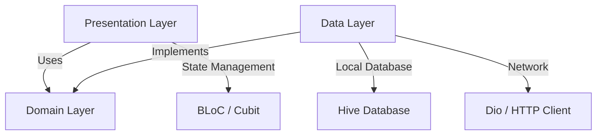

# 📖 eQuran App

Aplikasi **Al-Quran Digital Modern** berbasis **Flutter** yang dirancang dengan mengutamakan performa, estetika modern, dan arsitektur yang bersih (**Clean Architecture**). Aplikasi ini memadukan kemudahan membaca Al-Quran, mendengarkan lantunan murattal ayat demi ayat, mempelajari tafsir Kemenag RI, membaca kumpulan doa harian, hingga fitur ibadah lengkap kapan saja dan di mana saja.

---

## ✨ Fitur Utama

### 📖 Al-Quran

- **Daftar & Detail Surat** — 114 surat dengan pencarian instan. Teks Arab menggunakan font premium **Amiri**, lengkap dengan transliterasi latin dan terjemahan.
- **Tafsir Lengkap** — Pelajari makna mendalam setiap ayat melalui tafsir Kementerian Agama RI (Kemenag RI).
- **Pemutar Audio Murattal** — Dengarkan lantunan Al-Quran per-ayat maupun per-surat dari qori ternama. Dilengkapi manajemen storage untuk file audio lokal.
- **Catatan Ayat** — Tulis catatan pribadi yang terikat langsung ke ayat tertentu. Tersimpan lokal, bisa diedit dan dihapus.
- **Berbagi Ayat** — Generate gambar indah dari ayat pilihan untuk dibagikan ke media sosial via WhatsApp, Instagram, dan lainnya.

### 🕌 Ibadah & Spiritual

- **Jadwal Shalat & Notifikasi** — Waktu shalat fardhu lima waktu sesuai lokasi GPS, lengkap dengan notifikasi adzan otomatis yang bisa dikonfigurasi per waktu shalat.
- **Imsakiyah & Alarm Sahur/Imsak** — Jadwal imsakiyah bulanan dengan alarm sahur (default 60 menit sebelum imsak) dan alarm imsak yang bisa diatur sesuai kebutuhan.
- **Kompas Arah Kiblat (Qibla Finder)** — Arah kiblat real-time menggunakan sensor kompas fisik perangkat. Bekerja 100% offline.
- **Tasbih Digital** — Penghitung zikir dengan haptic feedback, target hitungan (33, 99, atau custom), dan riwayat sesi zikir.
- **Kumpulan Doa Harian** — Doa-doa pilihan dengan rekomendasi cerdas sesuai waktu (pagi, siang, malam).

### 📊 Progres & Gamifikasi

- **Hafalan Tracker** — Lacak progress hafalan Al-Quran per ayat, per surat, dan per juz. Dilengkapi mode setoran (self-test), spaced repetition muraja'ah otomatis (interval 1→3→7→30→90 hari), dan notifikasi pengingat muraja'ah.
- **Reading Progress** — Lacak progres membaca per surat secara otomatis saat scroll. Progress bar muncul di halaman utama dan daftar surat.
- **Quran Daily Streak** — Pantau konsistensi membaca Al-Quran dengan streak harian.
- **Sistem Bookmark & Terakhir Dibaca** — Simpan ayat penting dan lanjutkan tilawah dari posisi terakhir dengan satu ketukan.

### ⚙️ Kustomisasi & UX

- **Tema Terang, Gelap & Sepia** — Mode Sepia nyaman untuk membaca malam hari, seperti membaca di atas kertas.
- **Pengaturan Font Arab** — Atur ukuran font Arab sesuai kenyamanan visual.
- **Lokalisasi 3 Bahasa** — Bahasa Indonesia, English, dan العربية.
- **Reminder Baca Quran** — Pengingat harian dengan jam yang bisa dikustomisasi.

---

## 🏗️ Arsitektur & Teknologi



- **Clean Architecture** — Kode dipisahkan ke 3 layer: **Data**, **Domain**, dan **Presentation**.
- **State Management** — **BLoC / Cubit** (`flutter_bloc`) untuk unidirectional data flow yang mudah diuji.
- **Dependency Injection** — **GetIt** & **Injectable** untuk loose coupling dan inisialisasi dependensi otomatis.
- **Declarative Routing** — **GoRouter** untuk navigasi berbasis rute yang aman dan modular.
- **Local Caching** — **Hive CE** untuk penyimpanan data lokal super cepat (bookmarks, cache, settings, catatan, alarm prefs).

---

## 📦 Paket & Dependensi Utama

| Nama Package                          |        Versi        | Kegunaan                                     |
| :------------------------------------ | :-----------------: | :------------------------------------------- |
| **`flutter_bloc`**                    |      `^9.1.1`       | State management BLoC/Cubit                  |
| **`just_audio`**                      |      `^0.9.40`      | Pemutar audio murattal                       |
| **`audio_session`**                   |      `^0.1.21`      | Manajemen sesi audio perangkat               |
| **`dio`**                             |      `^5.5.0`       | HTTP Client dengan Interceptor               |
| **`hive_ce`** & **`hive_ce_flutter`** |      `^2.7.0`       | Database NoSQL lokal                         |
| **`go_router`**                       |      `^17.2.3`      | Declarative routing                          |
| **`get_it`** & **`injectable`**       | `^9.2.1` / `^3.0.0` | Dependency Injection                         |
| **`flutter_local_notifications`** | `^18.0.0` | Notifikasi lokal (adzan, alarm, reminder, hafalan) |
| **`timezone`**                        |      `^0.9.4`       | Timezone support untuk scheduling notifikasi |
| **`geolocator`**                      |      `^13.0.4`      | Lokasi GPS untuk jadwal shalat & kiblat      |
| **`geocoding`**                       |      `^3.0.0`       | Konversi koordinat ke nama wilayah           |
| **`flutter_compass`**                 |      `^0.8.1`       | Sensor kompas untuk Qibla Finder             |
| **`share_plus`**                      |      `^10.1.4`      | Berbagi konten (teks & gambar ayat)          |
| **`fpdart`**                          |      `^1.1.0`       | Functional Programming (`Either`, `Option`)  |
| **`freezed_annotation`**              |      `^3.1.0`       | Immutable class & union types                |
| **`equatable`**                       |      `^2.0.5`       | Perbandingan nilai objek                     |
| **`path_provider`**                   |      `^2.1.4`       | Akses direktori penyimpanan lokal            |
| **`intl`**                            |      `^0.20.1`      | Internasionalisasi & format tanggal          |
| **`url_launcher`**                    |      `^6.3.2`       | Membuka URL eksternal                        |

---

## 🎗️ Kredit & Apresiasi API

### **[equran.id](https://equran.id)** 🌟

Seluruh data surat, teks Arab, terjemahan, audio murattal, tafsir, hingga doa harian bersumber dari API gratis yang disediakan oleh **equran.id**.

> [!NOTE]
> Dukung keberlangsungan penyedia API ini dengan mengunjungi [equran.id](https://equran.id).

---

## 🚀 Cara Memulai

### 1. Prasyarat

- **Flutter SDK**: `>=3.22.0`
- **Dart SDK**: `>=3.8.0 <4.0.0`

### 2. Kloning Repositori

```bash
git clone https://github.com/Udean777/equran-app.git
cd equran-app
```

### 3. Instal Dependensi

```bash
flutter pub get
```

### 4. Jalankan Code Generator

```bash
dart run build_runner build --delete-conflicting-outputs
```

### 5. Jalankan Aplikasi

```bash
flutter run
```

---

## 🧪 Menjalankan Pengujian

```bash
flutter test
```

> 424 test — semua passed ✅

---

_Dibuat dengan penuh rasa cinta dan dedikasi untuk kemudahan membaca serta mempelajari Al-Quran secara digital. Semoga menjadi amal jariyah._ 🤲✨
