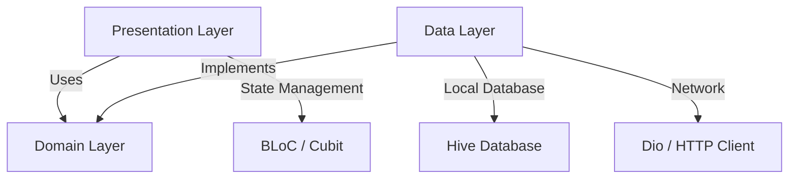

# 📖 eQuran App

Aplikasi **Al-Quran Digital Modern** berbasis **Flutter** yang dirancang dengan mengutamakan performa, estetika modern, dan arsitektur yang bersih (**Clean Architecture**). Aplikasi ini memadukan kemudahan membaca Al-Quran, mendengarkan lantunan murattal ayat demi ayat, mempelajari tafsir Kemenag RI, serta membaca kumpulan doa harian kapan saja dan di mana saja.

---

## ✨ Fitur Utama

Aplikasi eQuran dilengkapi dengan berbagai fitur premium untuk memberikan pengalaman ibadah digital terbaik:

- 📖 **Daftar & Detail Surat**: Menampilkan 114 surat Al-Quran dengan pencarian instan. Teks Arab disajikan menggunakan font premium **Amiri** yang indah, lengkap dengan transliterasi latin dan terjemahan Bahasa Indonesia.
- 🎧 **Pemutar Audio Murattal**: Dengarkan lantunan suci Al-Quran per-ayat maupun per-surat dari qori ternama. Didukung oleh pemutar audio latar belakang yang stabil.
- 📑 **Tafsir Lengkap**: Pelajari makna mendalam dari setiap ayat melalui tafsir terperinci dari Kementerian Agama Republik Indonesia (Kemenag RI).
- 🤲 **Kumpulan Doa Harian**: Kumpulan doa-doa pilihan dalam Islam lengkap dengan teks Arab, transliterasi latin, terjemahan, dan detail penjelasannya.
- 🕌 **Jadwal Shalat & Imsakiyah**: Menampilkan waktu shalat fardhu lima waktu secara presisi dan dinamis sesuai titik koordinat geografis pengguna melalui integrasi GPS otomatis.
- 🧭 **Kompas Arah Kiblat (Qibla Finder)**: Menentukan arah kiblat menuju Ka'bah secara real-time dan akurat menggunakan integrasi sensor kompas fisik perangkat.
- 📿 **Tasbih Digital**: Penghitung zikir interaktif dengan getaran (haptic feedback) saat tombol ditekan, pengaturan target hitungan (33, 99, atau tanpa batas), serta penyimpanan riwayat sesi zikir.
- 🔖 **Sistem Bookmark & Favorit**: Simpan dan tandai ayat atau surat penting untuk dibaca kembali secara cepat tanpa perlu mencari ulang.
- 🌓 **Tema Gelap & Terang (Dark/Light Mode)**: Desain antarmuka modern dengan dukungan mode gelap yang nyaman di mata untuk kenyamanan membaca di malam hari.
- ⚙️ **Pengaturan Fleksibel**: Atur ukuran font Arab sesuai kenyamanan visual Anda, ubah bahasa aplikasi (lokalisasi), dan sesuaikan preferensi lainnya.

---

## 🏗️ Arsitektur & Teknologi

Untuk menjamin skalabilitas, kemudahan pemeliharaan, dan performa yang tinggi, proyek ini dibangun di atas fondasi teknologi modern:



- **Clean Architecture**: Kode dipisahkan secara ketat ke dalam 3 layer utama:
  - **Data**: Menangani interaksi API dengan internet dan penyimpanan database lokal.
  - **Domain**: Berisi entitas bisnis murni dan UseCase (bebas dari framework dependency).
  - **Presentation**: Menangani tampilan UI dan state management (BLoC/Cubit).
- **State Management**: Menggunakan **BLoC (Business Logic Component) / Cubit** (`flutter_bloc`) untuk memastikan alur data bersifat satu arah (_unidirectional data flow_) dan mudah diuji.
- **Dependency Injection (DI)**: Menggunakan **GetIt** & **Injectable** untuk loose coupling dan inisialisasi dependensi yang otomatis dan rapi.
- **Declarative Routing**: Menggunakan **GoRouter** untuk sistem navigasi berbasis rute yang aman dan modular.
- **Local Caching**: Menggunakan **Hive CE** (Community Edition) untuk penyimpanan data lokal super cepat (bookmarks, cached surah/doa, settings).

---

## 📦 Paket & Dependensi yang Digunakan

Berikut adalah daftar package utama yang menopang keandalan aplikasi eQuran:

| Nama Package                          |        Versi        | Deskripsi & Kegunaan                                                                                     |
| :------------------------------------ | :-----------------: | :------------------------------------------------------------------------------------------------------- |
| **`flutter_bloc`**                    |      `^9.1.1`       | Manajemen state aplikasi menggunakan pattern BLoC/Cubit yang predictable.                                |
| **`just_audio`**                      |      `^0.9.40`      | Pemutar audio canggih untuk memutar murattal Al-Quran secara streaming atau lokal.                       |
| **`audio_session`**                   |      `^0.1.21`      | Mengelola sesi audio perangkat (seperti menjeda suara saat ada telepon masuk).                           |
| **`dio`**                             |      `^5.5.0`       | HTTP Client tangguh untuk memanggil endpoint API dengan dukungan Interceptor & Caching.                  |
| **`hive_ce`** & **`hive_ce_flutter`** |      `^2.7.0`       | Database NoSQL lokal super cepat untuk menyimpan Bookmarks, Tema, dan Cache data.                        |
| **`go_router`**                       |      `^17.2.3`      | Router deklaratif resmi Flutter untuk navigasi antar-halaman yang fleksibel.                             |
| **`get_it`** & **`injectable`**       | `^9.2.1` / `^3.0.0` | Service locator & generator untuk Dependency Injection otomatis di seluruh aplikasi.                     |
| **`geolocator`**                      |      `^13.0.4`      | Layanan penentuan lokasi GPS presisi untuk menentukan koordinat jadwal shalat dan arah kiblat.            |
| **`geocoding`**                       |      `^3.0.0`       | Mengonversi koordinat lintang/bujur GPS menjadi nama wilayah/kota secara dinamis.                        |
| **`flutter_compass`**                 |      `^0.8.1`       | Mengakses sensor kompas fisik perangkat untuk penentuan arah kiblat secara real-time.                     |
| **`fpdart`**                          |      `^1.1.0`       | Menghadirkan paradigma Pemrograman Fungsional (Functional Programming) seperti tipe `Either` & `Option`. |
| **`freezed_annotation`**              |      `^3.1.0`       | Mempermudah pembuatan class immutable dan union types (digunakan bersama `freezed` generator).           |
| **`equatable`**                       |      `^2.0.5`       | Membantu perbandingan nilai objek Dart secara instan tanpa menulis override `==` secara manual.          |
| **`path_provider`**                   |      `^2.1.4`       | Mengakses direktori penyimpanan lokal perangkat untuk database Hive dan file audio.                      |
| **`url_launcher`**                    |      `^6.3.2`       | Membuka tautan URL eksternal (situs web atau media eksternal) dengan aman dari aplikasi.                 |
| **`intl`**                            |      `^0.20.1`      | Solusi internasionalisasi teks, format angka, dan tanggal di dalam aplikasi.                             |

---

## 🎗️ Kredit & Apresiasi API

Proyek eQuran ini tidak akan terwujud tanpa kontribusi luar biasa dari penyedia data API Al-Quran. Kami mengucapkan terima kasih dan apresiasi sebesar-besarnya kepada:

### **[equran.id](https://equran.id)** 🌟

Sebagai penyedia API Al-Quran dan Doa gratis terlengkap di Indonesia. Seluruh data surat, teks Arab, terjemahan, audio murattal per-ayat, tafsir lengkap, hingga daftar doa harian di dalam aplikasi ini bersumber langsung dari layanan API gratis yang disediakan oleh **equran.id**.

> [!NOTE]
> Mari kita dukung keberlangsungan penyedia API ini dengan mengunjungi dan mengapresiasi karya mereka di [equran.id](https://equran.id).

---

## 🚀 Cara Memulai

Ikuti langkah-langkah di bawah ini untuk menjalankan proyek ini di mesin lokal Anda:

### 1. Prasyarat

- **Flutter SDK**: `>=3.22.0`
- **Dart SDK**: `>=3.8.0 <4.0.0`

### 2. Kloning Repositori

```bash
git clone https://github.com/Udean777/equran-app.git
cd equran-app
```

### 3. Instal Dependensi

Jalankan perintah berikut untuk mengunduh semua package yang diperlukan:

```bash
flutter pub get
```

### 4. Jalankan Code Generator

Karena proyek ini menggunakan generator untuk Dependency Injection (`injectable`), Data Model (`json_serializable`), dan Immutable Class (`freezed`), jalankan perintah berikut sebelum menjalankan aplikasi:

```bash
flutter pub run build_runner build --delete-conflicting-outputs
```

### 5. Jalankan Aplikasi

Jalankan aplikasi di emulator atau perangkat fisik Anda:

```bash
flutter run
```

---

## 🧪 Menjalankan Pengujian (Testing)

Proyek ini dilengkapi dengan unit test dan bloc test untuk memastikan keandalan logika bisnis. Jalankan perintah berikut untuk mengeksekusi semua pengujian:

```bash
flutter test
```

---

_Dibuat dengan penuh rasa cinta dan dedikasi untuk kemudahan membaca serta mempelajari Al-Quran secara digital. Semoga menjadi amal jariyah._ 🤲✨
