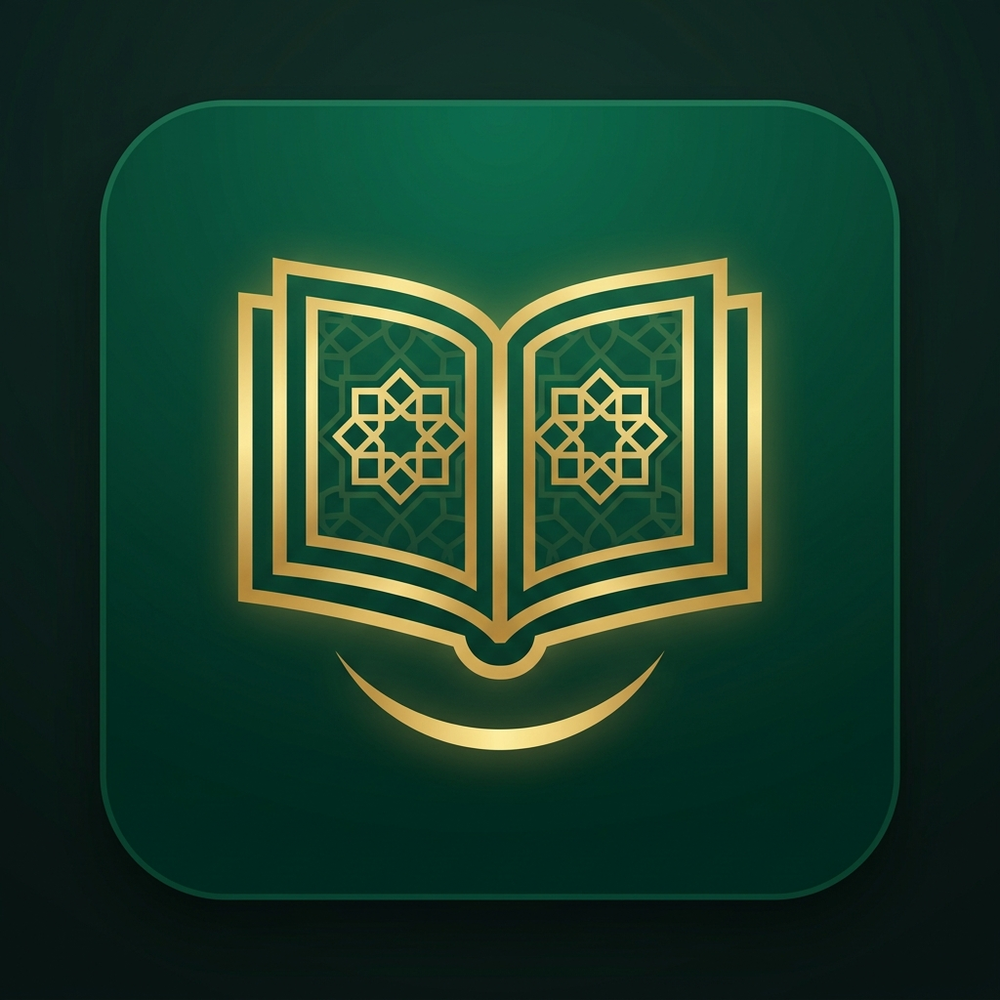
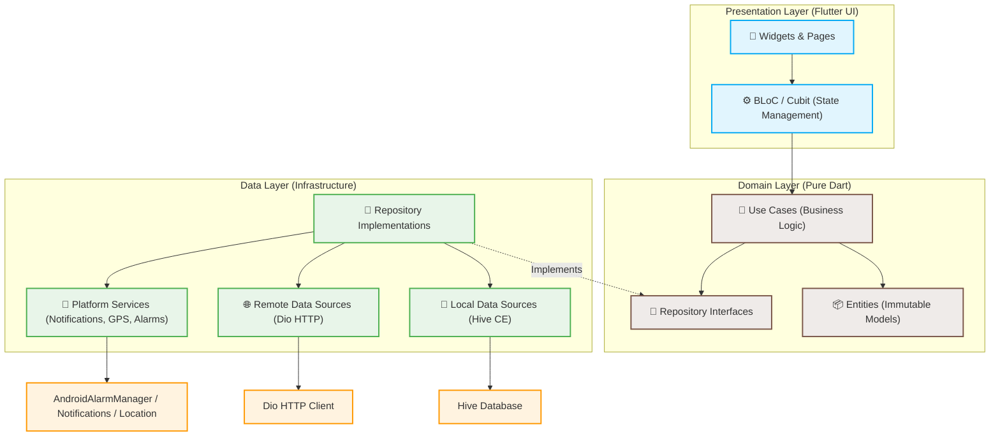

<div align="center">
  
  <h1>📖 Qurva</h1>
  
  <p>
    
    
    
    
  </p>
  
  <p><b>Aplikasi Al-Quran Digital Modern & Premium</b></p>
  
  <p>
    Dirancang dengan mengutamakan performa, estetika, dan arsitektur yang bersih (Clean Architecture). Qurva memadukan kenyamanan membaca Al-Quran, mendengarkan murattal ayat, mempelajari tafsir Kemenag RI, membaca doa harian, hingga pelacakan statistik ibadah yang interaktif.
  </p>
</div>

---

## 📱 Preview Aplikasi

Berikut adalah visualisasi antarmuka premium dari **Qurva** yang dirancang dengan estetika mewah, bersih, dan modern:

|                                          🌟 Premium Onboarding                                          |                                         📖 Daftar Surah (Home)                                         |                                            🎨 Membaca (Sepia Mode)                                            |
| :-----------------------------------------------------------------------------------------------------: | :----------------------------------------------------------------------------------------------------: | :-----------------------------------------------------------------------------------------------------------: |
|  |  |  |

|                                          🕌 Jadwal Shalat & Kompas                                           |                                           🤖 AI Setoran Hafalan                                           |                                               📊 Statistik & Heatmap                                               |
| :----------------------------------------------------------------------------------------------------------: | :-------------------------------------------------------------------------------------------------------: | :----------------------------------------------------------------------------------------------------------------: |
|  |  |  |

---

## ✨ Fitur Utama

### 📖 Al-Quran & Tafsir

- **Daftar & Detail Surat** — 114 surat dengan pencarian instan yang responsif. Teks Arab menggunakan font premium **Amiri** dan **KFGQPC Uthmanic Script HAFS** (font mushaf standar Arab Saudi) yang sangat nyaman dibaca, lengkap dengan transliterasi latin serta terjemahan bahasa Indonesia.
- **Tafsir Lengkap Kemenag RI** — Pelajari makna mendalam setiap ayat melalui tafsir Kementerian Agama Republik Indonesia (Kemenag RI) yang tersedia langsung per-ayat.
- **Pemutar Audio Murattal Ter-Agregasi** — Dengarkan lantunan Al-Quran per-ayat maupun per-surat penuh dari qori ternama. Indikator durasi dan progress pemutaran telah ter-agregasi secara mulus agar tidak berkedip atau mereset saat berpindah ayat dalam mode playlist.
- **Auto-Sync Last Read** — Sinkronisasi posisi membaca terakhir (_last read_) secara real-time saat audio murattal berpindah ayat secara otomatis.
- **Offline Audio & Storage Manager** — Download file audio murattal secara terpisah (per ayat maupun per surat) untuk diputar secara offline. Dilengkapi manajemen penyimpanan (_audio storage manager_) untuk memantau kapasitas memori dan menghapus cache audio lokal secara dinamis.
- **Catatan Ayat** — Tulis catatan spiritual pribadi yang terikat langsung pada ayat tertentu. Catatan tersimpan secara lokal dan aman via database offline (bisa diedit, dihapus, dan dibagikan).
- **Berbagi Ayat Premium** — Generate gambar indah dengan desain elegan dari ayat pilihan untuk dibagikan secara instan ke media sosial seperti WhatsApp, Instagram, Telegram, dan lainnya.

### 🕌 Ibadah & Spiritual

- **Jadwal Shalat Otomatis** — Waktu shalat fardhu lima waktu akurat sesuai koordinat GPS real-time. Dilengkapi nama wilayah yang ter-reverse secara dinamis menggunakan _geocoding_.
- **Timezone Tangguh & Notifikasi Adzan** — Inisialisasi timezone otomatis yang beradaptasi dengan nama zona waktu lokal (WIB, WITA, WIT, dll.). Notifikasi adzan latar belakang berjalan andal pada Android dan iOS tanpa terputus ketika user berinteraksi dengan notification shade.
- **Alarm Sahur & Imsak Independen** — Pengaturan alarm sahur (default 60 menit sebelum imsak) dan alarm imsak yang terjadwal secara terpisah dari notifikasi shalat, menghindari resiko bentrok atau terhapus saat proses sinkronisasi ulang.
- **Kompas Kiblat Offline (Qibla Finder)** — Kompas penunjuk arah kiblat real-time yang bekerja 100% offline dengan memanfaatkan sensor magnetometer perangkat fisik.
- **Tasbih Digital Interaktif** — Penghitung zikir yang dilengkapi dengan feedback getar (_haptic feedback_), target hitungan fleksibel (33, 99, atau custom), serta pencatatan riwayat sesi zikir yang lengkap.
- **Kumpulan Doa Harian** — Doa-doa pilihan lengkap dengan teks Arab, latin, terjemahan, dan bookmark doa, serta rekomendasi cerdas sesuai waktu hari (Pagi, Siang, Malam).

### 📊 Progres & Statistik Ibadah

- **Statistik Baca (Reading Progress)** — Lacak progress tilawah secara otomatis melalui deteksi scroll aktif (_viewport detection_). Menampilkan visualisasi premium berupa heatmap aktivitas 90 hari (GitHub-style), progress bar juz (30 juz), surat yang paling sering dibaca, dan grafik membaca harian.
- **Statistik Shalat Harian** — Pencatatan mandiri (_self-logging_) shalat fardhu dengan status shalat (Tepat Waktu, Qadha, Tidak Shalat). Dilengkapi kalender interaktif bulanan, streak shalat berturut-turut, grafik batang (bar chart) mingguan, checklist reminder otomatis, serta fitur export log data shalat ke format CSV.
- **Hafalan Tracker & Spaced Repetition** — Lacak progres hafalan per ayat, per surat, dan per juz. Dilengkapi mode setoran (self-test mode dengan menyembunyikan teks Arab), pengingat muraja'ah otomatis berbasis metode _spaced repetition_ (interval 1 → 3 → 7 → 30 → 90 hari), dan notifikasi muraja'ah harian.
- **🤖 AI Setoran Hafalan (Whisper STT)** — Fitur revolusioner untuk mengevaluasi hafalan secara otomatis menggunakan teknologi **Whisper Speech-to-Text** dari OpenAI. Rekam bacaan hafalan, sistem AI akan mentranskrip dan membandingkan dengan teks asli, lalu memberikan skor akurasi real-time (Character Error Rate). Threshold passing default 85%, dengan feedback detail per kata yang salah. Backend Python (FastAPI + faster-whisper) berjalan di server cloud (Render) atau local development.
- **Quran Daily Streak & Bookmark** — Hitung konsistensi membaca Al-Quran harian dengan streak counter serta sistem penanda halaman/bookmark multi-kategori yang aman.

### ⚙️ Kustomisasi Premium & UX Modern

- **Slide Onboarding Premium** — Pengenalan aplikasi interaktif sebanyak 6 slide untuk memandu konfigurasi awal (izin lokasi, notifikasi, pengenalan fitur Al-Quran, Jadwal Shalat, Hafalan, hingga inisialisasi aplikasi).
- **Desain Adaptif Multi-Tema** — Mode Terang, Gelap, dan **Sepia** (mode membaca khusus yang dirancang dengan temperatur warna hangat untuk mengurangi kelelahan mata di malam hari).
- **Pilihan Font & Ukuran Kustom** — Pengaturan fleksibel ukuran teks Arab, serta pemilihan tipe font Mushaf premium (font mushaf standar **Amiri** atau **KFGQPC**).
- **Lokalisasi Multi-Bahasa** — Bahasa Indonesia, English, dan العربية.
- **Branding Elegan & Optimalisasi RAM** — Integrasi ikon resmi Qurva di berbagai area (Welcome Slide, Success Slide, Home AppBar, App Drawer Header, Loading State, dll.). Menggunakan _pre-caching_ gambar dinamis dan pembatasan RAM (`cacheWidth`/`cacheHeight`) pada pemrosesan aset gambar agar memori tetap ringan dan performa anti-lag yang mulus.

---

## 🏗️ Arsitektur & Teknologi

Qurva dibangun dengan memisahkan kode program ke dalam tiga layer utama berdasarkan prinsip **Clean Architecture & Domain Driven Design (DDD)** untuk menjamin keterbacaan kode, kemudahan pengujian, serta perluasan fitur di masa mendatang.



### Penjelasan Arsitektur:

1. **Presentation Layer**: Menangani visualisasi antarmuka dan interaksi pengguna. Menggunakan **BLoC & Cubit** (`flutter_bloc`) untuk _state management_ reaktif yang bersih dan terisolasi dengan aliran data searah (_unidirectional data flow_).
2. **Domain Layer**: Merupakan inti (core) dari bisnis logik aplikasi yang bersifat murni (Pure Dart) dan tidak memiliki ketergantungan terhadap external packages, library, atau UI framework. Terdiri dari Entities (termasuk immutable data model dengan Freezed & Equatable) dan Usecases.
3. **Data Layer**: Mengimplementasikan kontrak repositori dari Domain Layer. Menangani data lokal (Hive boxes) dan data remote (Dio HTTP client dengan interceptor & auto-retry), serta layanan sistem platform (AlarmManager, Notifications, Location Services).
4. **Dependency Injection**: Menggunakan **GetIt** & **Injectable** untuk pendaftaran dependensi secara otomatis melalui _code generation_.
5. **Declarative Routing**: Menggunakan **GoRouter** untuk navigasi berbasis rute aman, modular, dan mendukung parameter dinamis serta redirect logic (misal: onboarding state redirection).

---

## 📦 Paket & Dependensi Utama

| Nama Package                          |        Versi        | Kegunaan                                                           |
| :------------------------------------ | :-----------------: | :----------------------------------------------------------------- |
| **`flutter_bloc`**                    |      `^9.1.1`       | State management berbasis BLoC & Cubit                             |
| **`just_audio`**                      |      `^0.9.40`      | Pemutar audio murattal                                             |
| **`audio_session`**                   |      `^0.1.21`      | Manajemen sesi audio perangkat                                     |
| **`audio_service`**                   |      `^0.18.0`      | Pemutaran audio latar belakang                                     |
| **`dio`**                             |      `^5.5.0`       | HTTP Client dengan Interceptor dan penanganan error                |
| **`hive_ce`** & **`hive_ce_flutter`** | `^2.7.0` / `^2.2.0` | Database NoSQL lokal super cepat untuk caching & local preferences |
| **`go_router`**                       |      `^17.2.3`      | Declarative routing system                                         |
| **`get_it`** & **`injectable`**       | `^9.2.1` / `^3.0.0` | Dependency Injection & Auto service registration                   |
| **`flutter_local_notifications`**     |      `^18.0.0`      | Notifikasi lokal (adzan, alarm, reminder baca, dll.)               |
| **`android_alarm_manager_plus`**      |      `^4.0.7`       | Penjadwalan latar belakang (Background alarm scheduler) di Android |
| **`timezone`**                        |      `^0.9.4`       | Konfigurasi timezone untuk notifikasi terjadwal                    |
| **`geolocator`**                      |      `^13.0.4`      | Mengakses lokasi GPS untuk jadwal shalat & kiblat                  |
| **`geocoding`**                       |      `^3.0.0`       | Konversi koordinat lokasi GPS ke nama kota/wilayah                 |
| **`flutter_compass`**                 |      `^0.8.1`       | Sensor kompas fisik untuk Qibla Finder                             |
| **`share_plus`**                      |      `^10.1.4`      | Berbagi konten (teks & gambar ayat) ke media sosial                |
| **`table_calendar`**                  |      `^3.1.2`       | Kalender bulanan interaktif untuk log Statistik Shalat             |
| **`fpdart`**                          |      `^1.1.0`       | Penerapan Functional Programming (`Either`, `Option`)              |
| **`freezed_annotation`**              |      `^3.1.0`       | Code generation untuk immutable class & union types                |
| **`equatable`**                       |      `^2.0.5`       | Perbandingan nilai objek                                           |
| **`path_provider`**                   |      `^2.1.4`       | Akses direktori penyimpanan lokal (audio download & Hive db)       |
| **`intl`**                            |      `^0.20.1`      | Format tanggal, waktu, dan lokalisasi bahasa                       |
| **`url_launcher`**                    |      `^6.3.2`       | Membuka tautan URL eksternal                                       |
| **`synchronized`**                    |     `^3.1.0+1`      | Mutex lock untuk penulisan data bersama secara aman                |
| **`gal`**                             |      `^2.3.2`       | Menyimpan gambar ayat hasil generate ke galeri perangkat           |
| **`google_fonts`**                    |      `^8.1.0`       | Integrasi font premium tambahan secara dinamis                     |
| **`package_info_plus`**               |      `^8.1.2`       | Informasi info aplikasi (versi, nama build, dll.)                  |
| **`record`**                          |      `^6.0.0`       | Merekam audio untuk AI Setoran Hafalan (voice recording)           |

---

## 🤖 AI Backend (Hafalan Speech-to-Text)

Qurva dilengkapi dengan backend Python berbasis **FastAPI** dan **faster-whisper** untuk fitur AI Setoran Hafalan.

### Teknologi

- **Framework**: FastAPI 0.138.0
- **Speech-to-Text**: faster-whisper (tiny model, ~39MB)
- **Scoring**: Levenshtein Distance → Character Error Rate (CER)
- **Deployment**: Render (cloud) atau local development
- **Testing**: pytest (19 unit tests)

### Cara Menjalankan Backend (Local)

1. **Masuk ke direktori server**:

```bash
cd server
```

2. **Install dependencies**:

```bash
pip install -r requirements.txt
```

3. **Jalankan server**:

```bash
uvicorn main:app --reload --host 0.0.0.0 --port 8000
```

4. **Test health endpoint**:

```bash
curl http://localhost:8000/health
```

5. **Update Flutter app**:
   Edit `lib/features/hafalan/constants/hafalan_constants.dart`:

```dart
static const String apiBaseUrl = 'http://YOUR_IP:8000'; // ganti YOUR_IP dengan IP laptop
```

### Deployment ke Render

Lihat panduan lengkap di: **[DEPLOY_RENDER.md](DEPLOY_RENDER.md)**

- ✅ Auto-deploy dari GitHub (branch `dev` atau `main`)
- ✅ Free tier: 750 compute hours/month, 512MB RAM
- ✅ Blueprint config: `render.yaml`
- ✅ CI/CD: `.github/workflows/server.yml`

**Endpoint Production**: `https://equran-hafalan-api.onrender.com`

### API Endpoints

#### `POST /compare`

Compare recorded audio dengan target text (ayat Al-Quran).

**Request** (multipart/form-data):

- `user_audio`: file audio (.m4a, .wav, .mp3)
- `target_text`: string (teks Arab ayat)
- `threshold`: float (default 85.0)

**Response**:

```json
{
  "score": 92.5,
  "passed": true,
  "transcribed": "بسم الله الرحمن الرحيم",
  "target": "بِسْمِ ٱللَّهِ ٱلرَّحْمَـٰنِ ٱلرَّحِيمِ",
  "cer": 0.075,
  "word_errors": [],
  "duration_ms": 1850
}
```

#### `GET /health`

Health check untuk monitoring server status.

**Response**:

```json
{
  "status": "ok"
}
```

---

## 🎗️ Kredit & Apresiasi API

### **[equran.id](https://equran.id)** 🌟

Seluruh data surat, teks Arab, terjemahan, audio murattal, tafsir, hingga kumpulan doa harian bersumber dari API gratis yang disediakan oleh **equran.id**.

> [!NOTE]
> Dukung keberlangsungan penyedia API ini dengan mengunjungi [equran.id](https://equran.id).

### **[IslamDownload.net](https://islamdownload.net)** 🎧

Suara adzan gratis yang digunakan untuk notifikasi waktu shalat fardhu dan adzan Subuh bersumber dari koleksi audio adzan di **[IslamDownload.net](https://islamdownload.net/123801-download-suara-adzan.html)**.

---

## 🚀 Cara Memulai

### 1. Prasyarat

- **Flutter SDK**: `>=3.22.0`
- **Dart SDK**: `>=3.8.0 <4.0.0`

### 2. Kloning Repositori

```bash
git clone https://github.com/Udean777/equran-app.git
cd equran-app
```

### 3. Instal Dependensi

```bash
flutter pub get
```

### 4. Jalankan Code Generator

```bash
dart run build_runner build --delete-conflicting-outputs
```

### 5. Jalankan Aplikasi

```bash
flutter run
```

---

## 🏗️ Build Production (Makefile)

Aplikasi ini dilengkapi dengan **Makefile** untuk memudahkan proses kompilasi production:

```bash
# APK per ABI (arm64, armv7, x86_64 — ukuran optimal & ringan)
make build-android-apk

# App Bundle (untuk upload ke Google Play Store)
make build-android-aab

# iOS IPA (membutuhkan Mac dengan Xcode)
make build-ios

# Web Build (CanvasKit renderer dengan PWA offline-first strategy)
make build-web

# Analisis detail ukuran APK
make analyze-size

# Bersihkan build artifacts
make clean
```

---

## 🧪 Menjalankan Pengujian

Aplikasi ini dilengkapi dengan pengujian unit dan integrasi yang menyeluruh:

```bash
flutter test
```

> **545 tests — semua passed ✅**

---

_Dibuat dengan penuh rasa cinta dan dedikasi untuk memudahkan umat Islam dalam membaca, menghafal, serta mempelajari Al-Quran secara digital. Semoga menjadi amal jariyah._ 🤲✨
